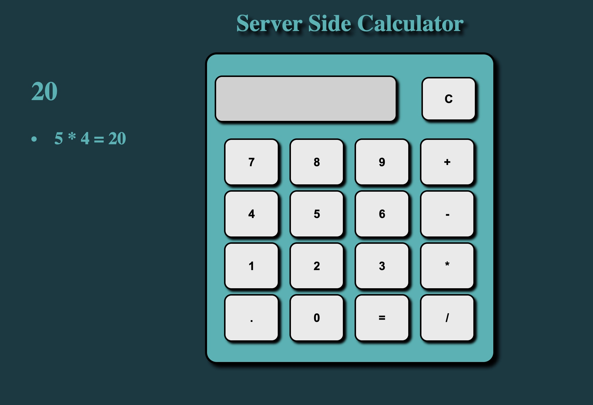

# Weekend jQuery Server Server Calculator

## Description

_Duration: 12 hours_

For this project, I created a calculator that is able to run basic addition, subtraction, multiplication, and division. This was also created with Node Express which gives it a server side to store the calculation history after it is rendered to the DOM. 

## Screen Shot

## Prerequisites

- JQuery
- Node.js
- Express

## Installation 

1. To install, section "Use this template" at the top of this page to fork and clone this repo. 

2. Open project in a code editor of your choice and use the terminal command "npm install" in terminal.

3. Again in terminal run, "npm run start".

4. Then, open browser and visit http://localhost:5000/

## Usage 

This application functions like a real calculator. See the steps listed down below.

1. Select the first integer value

2. Then, select a mathematical symbol

3. Choose a second integer value

4. Then press "=" to see the result.

## Built With

- Node.js
- Express
- JQuery
- JavaScript
- CSS
- HTML

## Acknowledgement
Thanks to [Prime Digital Academy](www.primeacademy.io) who equipped and helped me to make this application a reality. (Thank you, Prime!)